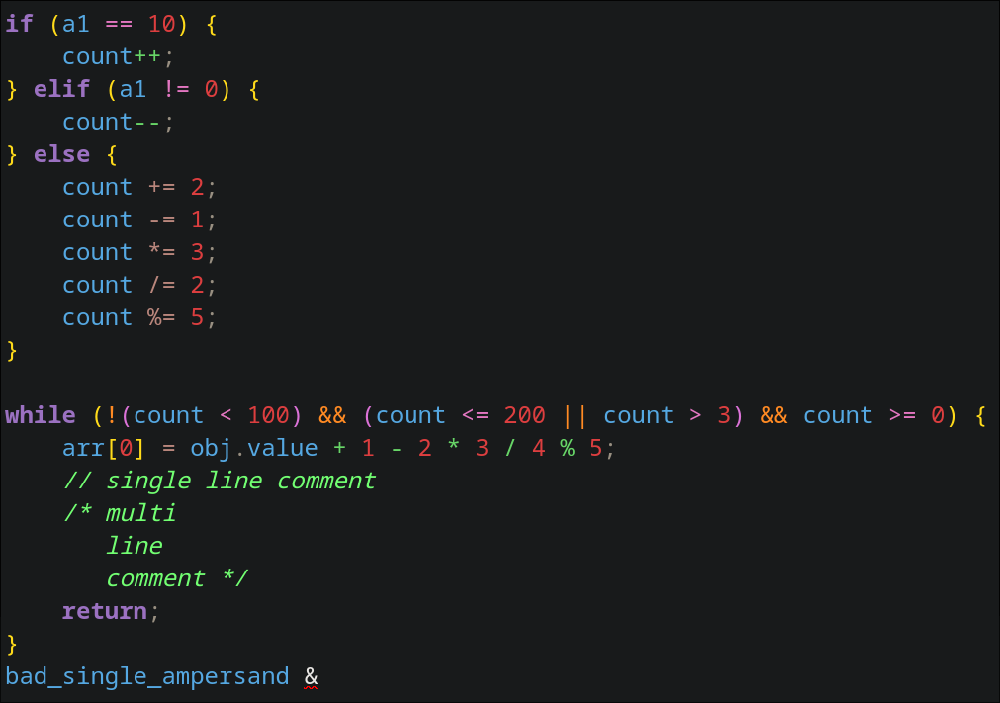

## Język implementacji

Python 3.14

## Tabela tokenów

### SimpleMath

| KOD | Opis | Przykład |
| :--- | :--- | :--- |
| IDENTIFIER | Nazwa zmiennej lub funkcji (`[a-zA-Z][a-zA-Z0-9]*`) | `x`, `var1`, `speed` |
| NUMBER | Ciąg cyfr (`[0-9]+`) | `123`, `7`, `500` |
| PLUS | Operator dodawania (`+`) | `+` |
| MINUS | Operator odejmowania (`-`) | `-` |
| MULTIPLY | Operator mnożenia (`*`) | `*` |
| DIVIDE | Operator dzielenia (`/`) | `/` |
| LPAREN | Lewy nawias `(` | `(` |
| RPAREN | Prawy nawias `)` | `)` |
| INVALID | Niepoprawny token (znak spoza gramatyki) | `@`, `#` |

### SimpleProgramming

| KOD | Opis | Przykład |
| :--- | :--- | :--- |
| IDENTIFIER | Nazwa identyfikatora (`[a-zA-Z_][a-zA-Z0-9_]*`) | `x`, `count_1`, `_tmp` |
| NUMBER | Liczba całkowita (`[0-9]+`) | `0`, `42`, `1000` |
| KEYWORD | Słowo kluczowe (`if`, `else`, `while`, `return`, `elif`) | `if`, `return` |
| PLUS | Operator dodawania (`+`) | `+` |
| MINUS | Operator odejmowania (`-`) | `-` |
| STAR | Operator mnożenia (`*`) | `*` |
| SLASH | Operator dzielenia (`/`) | `/` |
| PERCENT | Operator modulo (`%`) | `%` |
| PLUS_PLUS | Operator inkrementacji (`++`) | `++` |
| MINUS_MINUS | Operator dekrementacji (`--`) | `--` |
| ASSIGN | Przypisanie (`=`) | `=` |
| PLUS_EQUALS | Przypisanie z dodawaniem (`+=`) | `+=` |
| MINUS_EQUALS | Przypisanie z odejmowaniem (`-=`) | `-=` |
| STAR_EQUALS | Przypisanie z mnożeniem (`*=`) | `*=` |
| SLASH_EQUALS | Przypisanie z dzieleniem (`/=`) | `/=` |
| PERCENT_EQUALS | Przypisanie z modulo (`%=`) | `%=` |
| DOUBLE_EQUALS | Równość (`==`) | `==` |
| NOT_EQUALS | Nierówność (`!=`) | `!=` |
| LESS_THAN | Mniejsze niż (`<`) | `<` |
| GREATER_THAN | Większe niż (`>`) | `>` |
| LESS_THAN_EQUALS | Mniejsze lub równe (`<=`) | `<=` |
| GREATER_THAN_EQUALS | Większe lub równe (`>=`) | `>=` |
| LOGICAL_NOT | Negacja logiczna (`!`) | `!` |
| LOGICAL_AND | Koniunkcja logiczna (`&&`) | `&&` |
| LOGICAL_OR | Alternatywa logiczna (`\|\|`) | `\|\|` |
| LPAREN | Lewy nawias `(` | `(` |
| RPAREN | Prawy nawias `)` | `)` |
| LBRACE | Lewa klamra `{` | `{` |
| RBRACE | Prawa klamra `}` | `}` |
| LBRACKET | Lewy nawias kwadratowy `[` | `[` |
| RBRACKET | Prawy nawias kwadratowy `]` | `]` |
| DOT | Kropka (`.`) | `.` |
| SEMICOLON | Średnik (`;`) | `;` |
| COMMENT_SINGLE | Komentarz jednoliniowy (`//...`) | `// komentarz` |
| COMMENT_MULTI | Komentarz wieloliniowy (`/*...*/`) | `/* komentarz */` |
| WHITESPACE | Białe znaki (spacje, taby, nowa linia) | ` `, `\n`, `\t` |
| INVALID | Niepoprawny token (znak lub sekwencja spoza gramatyki) | `@`, pojedyncze `&` |

## Użytkowanie
```
usage: main.py [-h] [-g {SimpleMath,SimpleProgramming}] (-f FILE | text)

A simple scanner

positional arguments:
  text                  Scanner input

options:
  -h, --help            show this help message and exit
  -f, --file FILE       Path to the file with input
  -g, --grammar {SimpleMath,SimpleProgramming}

python main.py -g SimpleMath "test123 + 45 / 10"

python main.py \
  -g SimpleProgramming \
  -f assets/example_simple_programming_rainbow_parentheses.txt
```

## Przykłady

